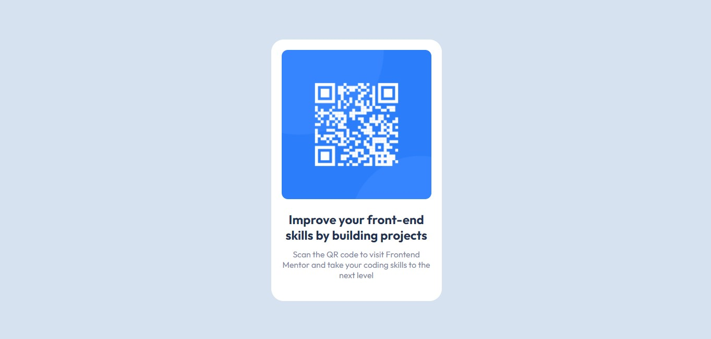

# Frontend Mentor - QR code component solution

This is a solution to the [QR code component challenge on Frontend Mentor](https://www.frontendmentor.io/challenges/qr-code-component-iux_sIO_H). Frontend Mentor challenges help you improve your coding skills by building realistic projects.

## Table of contents

- [Overview](#overview)
  - [Screenshot](#screenshot)
  - [Links](#links)
- [My process](#my-process)
  - [Built with](#built-with)
  - [What I learned](#what-i-learned)
- [Author](#author)

## Overview

### Screenshot




## My process

### Built with

- Semantic HTML5 markup
- CSS custom properties
- Flexbox

### What I learned

In the development of this component I discovered a class naming methodology called "BEM (Block Element Modifier)" which has the purpose of dividing my application into small reusable components.

if I understand correctly, the class can be divided into three parts. The first part refers to the component block or the component itself. The second part refers to the elements that make up that component or that are meaningless when used outside the component. component component One way to differentiate the block and the element in the class definition is by using double underscores The third part refers to the modification that has occurred in the element or in the block itself we separate the word that represents the modification with two hyphens, see the following code:

```html
<h1 class="qr-card__title">Improve your front-end skills by building projects</h1>
```

the class of this <p> element starts with "qr code" to indicate which component this element is, then we see in the class separated by two underscores the word "title" which indicates what this element's function is

and if for some reason we wanted to insert another title, but smaller, we would have to copy the class "qr_code\_\_title" and add at the end separated by two hyphens the word that will represent the modification of that element in the case below would be "small" see the following code:

```html
<h1 class="qr-card__title--small">Improve your front-end skills by building projects</h1>
```

as it is a new methodology for me, I may have misunderstood it, so I will review it on the official website and continue to apply it in my projects in the future so that I can really learn.

## Author

- Frontend Mentor - [@Renato-sousa-dev](https://www.frontendmentor.io/profile/Renato-sousa-dev)
